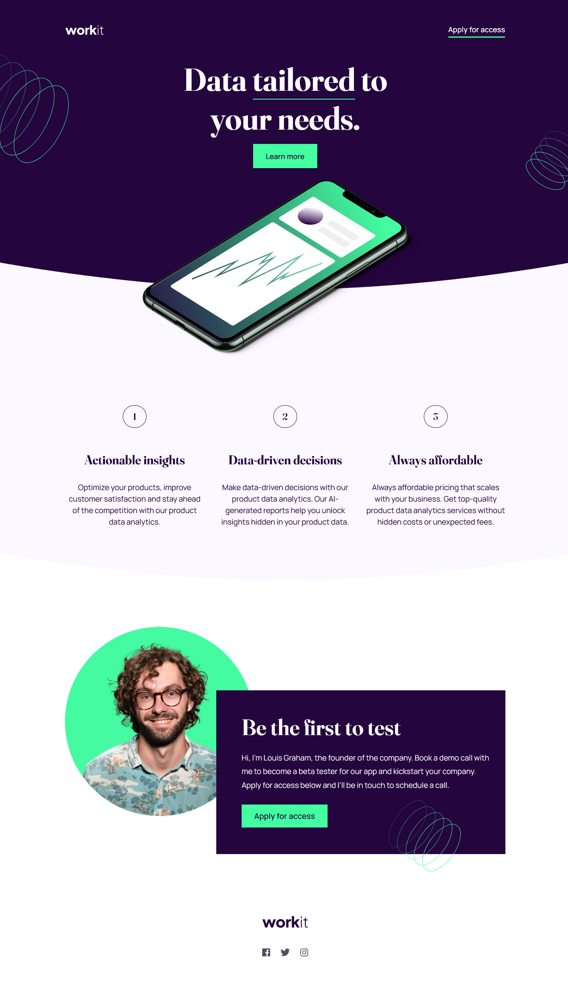

# Projeto: Workit landin page

Esta é a minha solução para o [desafio *Workit landing page* do site Frontend Mentor](https://www.frontendmentor.io/challenges/workit-landing-page-2fYnyle5lu). Este é meu quarto desafio na plataforma e esta prática tem me ajudado a melhorar minhas habilidades na codificação de projetos realistas. 
## Índice 
- [Visão Geral](#visão-geral)
- [O Desafio](#o-desafio)
- [Captura de tela](#captura-de-tela)
- [Links](#links)
- [Meu processo](#meu-processo)
- [Construído com](#construido-com)
- [O que aprendi](#o-que-aprendi)
- [Desenvolvimento contínuo](#desenvolvimento-continuo)
- [Recursos Úteis](#recursos-uteis)
- [Autor](#autor)
- [Agradecimentos](#agradecimentos)

## Visão Geral
Este é meu quarto trabalho desenvolvido a partir dos desafios propostos no site [Frontend Mentor](https://www.frontendmentor.io/home). Os desafios do Frontend Mentor ajudam-me a melhorar minhas habilidades em HTML, CSS e JavaScript.
### O Desafio
O desafio consiste em construir uma página o mais semelhante possível ao modelo fornecido em arquivo Figma, utilizando somente HTML e CSS, para 03 diferentes tamanhos de telas: mobile (375px), tablet (768px) e desktop(1440px). São fornecidos os arquivos de imagem e de fontes necessários para a construção da página, bem como o arquivo figma.

### Captura de tela
 

### Links
•	URL da solução: [Add solution URL here](https://your-solution-url.com)

## Meu processo
Iniciei pela tela desktop e fui reduzindo para tela mobile.
### Construido com

### O que aprendi
Meu maior aprendizado foi ter trabalhado em um projeto maior, uma página completa contendo áreas de cabeçalho, principal e rodapé bem definidas, exigindo um bom planejamento prévio.  
### Desenvolvimento continuo

Pretendo fazer outros desafios de maior complexidade afim de fixar todo o conhecimento abordado durante o curso. Em meus próximos desafios, planejo desenvolver um projeto com *JavaScript*, linguagem fundamental para o desenvolvimento de páginas Web, da qual tenho feito alguns estudos para aprimorar minhas habilidades.

### Recursos uteis

- [Fonte 1](https://www.cursoemvideo.com) - Foi aqui que adquiri meus primeiros conhecimentos sobre Desenvolvimento Web.
- [Fonte 2](https://www.alura.com.br) - Plataforma de cursos de tecnologia extraordinária. Bebo todos os dias desta fonte de conhecimento.

## Autor

- Website - Não o tenho, ainda! 
- Frontend Mentor - [@DinaelDomingos](https://www.frontendmentor.io/profile/DinaelDomigos)
- Twitter - [@DinaelDomingos](https://www.twitter.com/DinaelDomingos)

## Agradecimentos
Agradeço ao Professor Gustavo Guanabara [@gustavoguanabara](https:/instagram.com/gustavoguanabara), fundador do site [Curso em Video](https://www.cursoemvideo.com). Foi através de seus cursos de HTML e CSS, na 
